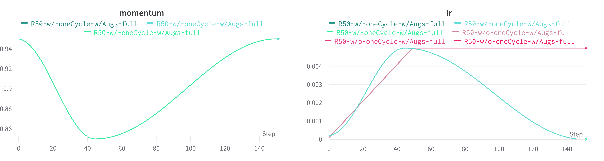
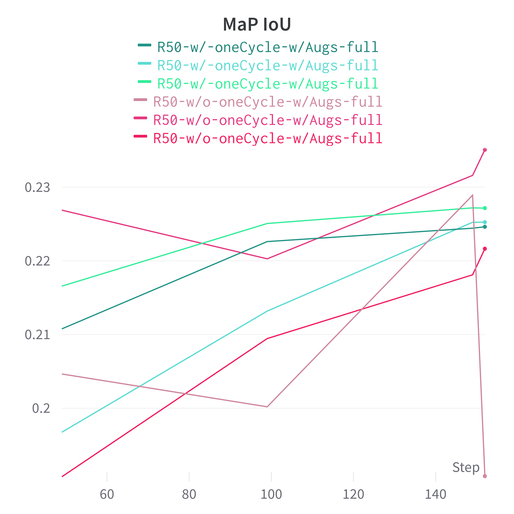
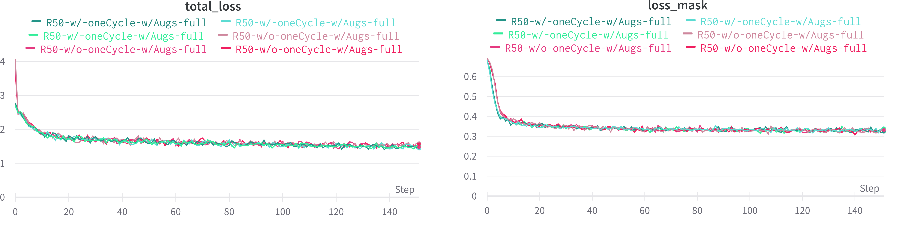
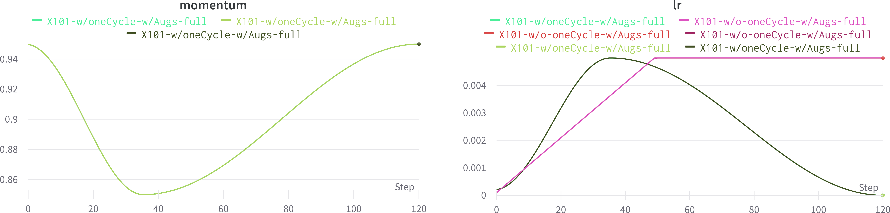
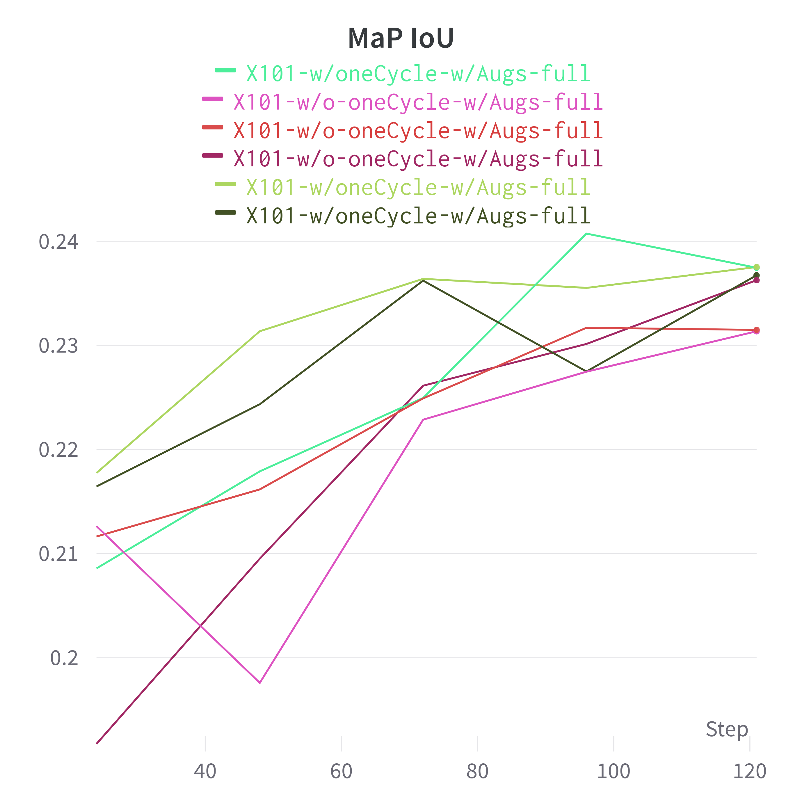
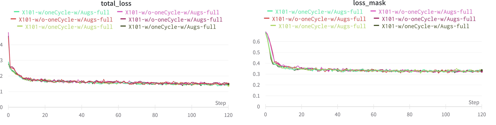

# Compare OneCycle to regular Detectron Training
Training is done on the Sartorius Cell Segmentation Dataset (source: "kaggle"). The XRes runs are over 20 epochs (~2400 iterations) where as the ResNet runs are over 25 epochs (~3000 iterations). All runs use a batch size of 2 and lite augmentation (rotation | flip | contrast | brightness | saturation) at an image size of 520 x 704 (original image size).

## Result
Of course, a few runs on a particular dataset can not draw a conclousion, but it seems that 1cycle policy leads to slightly better and more reliable training results with Detectron. [See more/interactive graphs.](https://wandb.ai/ben-karr/CellSeg/reports/Compare-OneCycle-to-regular-Detectron-Training--VmlldzoxNDAyNTAy?accessToken=x261u35es8l3t8x5dynd3g8q947euoq127eegmyivsvizfe6a12c21z32dpf9nsx)

__1CyclePolicy:__ greenish; 
__Regular:__ redish

## Res50

## XRes101

